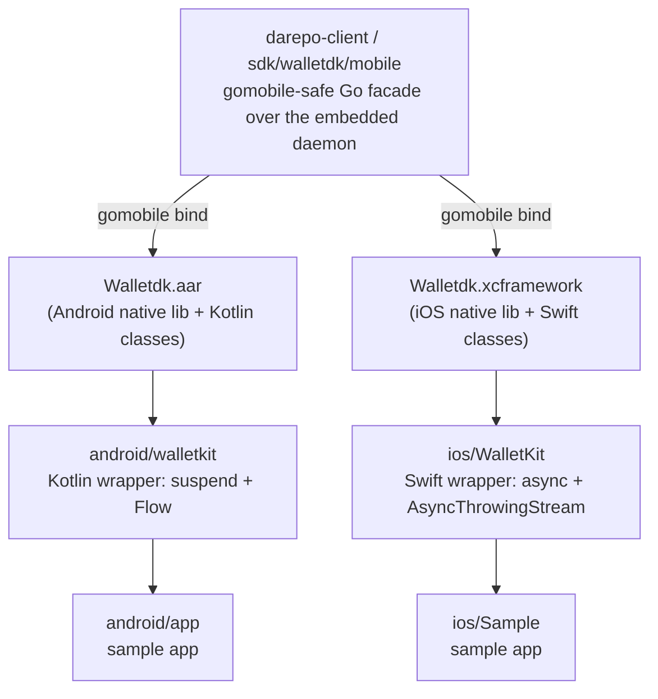

# damobile

Run a self-custodial Ark wallet inside a mobile app, with no separate daemon
process and no open network port.

`damobile` holds the host-side samples and (soon) the idiomatic Kotlin and
Swift wrappers for the [darepo-client](https://github.com/lightninglabs/darepo-client)
wallet SDK. That SDK embeds a full `darepod` wallet and exposes it to mobile
through [`gomobile`](https://pkg.go.dev/golang.org/x/mobile/cmd/gomobile). The
wallet runs in the app's own process; the app calls it across a private
in-memory gRPC channel, so nothing ever listens on a socket.

## How the pieces fit



The Go facade and the binding build live in **darepo-client**
(`sdk/walletdk/mobile`, `make mobile-android` / `mobile-ios`). This repo
consumes the bindings and shows an app driving them end to end: boot the
embedded wallet, create a key, sync the chain from Esplora, and read balances.

## Repository layout

| Path | Contents |
|------|----------|
| `android/walletkit/` | Idiomatic Kotlin wrapper (`suspend` + `Flow` + typed models) over the generated bindings. The Android library other apps depend on. |
| `android/app/` | Sample Android app (Jetpack Compose, AGP 9) that drives `walletkit`. |
| `ios/WalletKit/` | Idiomatic Swift wrapper (`actor` + `async` + `AsyncThrowingStream` + `Codable`). Mirrors the Kotlin library. |
| `scripts/fetch-aar.sh` | Builds `Walletdk.aar` from a sibling `darepo-client` checkout and stages it under `android/walletkit/libs`. |
| `scripts/fetch-xcframework.sh` | Same for the iOS `Walletdk.xcframework`. |
| `docs/` | Architecture, the Android workflow, and signet setup. |

The Android wrapper, sample, and signet flow are working end to end. The Swift
wrapper sources are complete; an iOS sample app and CI build are next.

## Quick start (Android)

You need three things:

1. A `darepo-client` checkout beside this repo (the script builds the `.aar`
   from it).
2. The Android SDK and NDK. The [`android` CLI](https://developer.android.com/tools/agents/android-cli)
   installs them: `android sdk install platform-tools emulator
   platforms/android-36 build-tools/36.1.0 ndk/29.0.14206865
   system-images/android-36/google_apis/arm64-v8a`.
3. A modern JDK (17 or newer).

```bash
# 1. Build the bindings from darepo-client and stage them here.
#    Point DAREPO_CLIENT_DIR elsewhere if your checkout is not ../darepo-client.
./scripts/fetch-aar.sh

# 2. Build the sample app.
cd android && ./gradlew :app:assembleDebug

# 3. Run it on an emulator (or a device).
android emulator start medium_phone
android run --apks=app/build/outputs/apk/debug/app-debug.apk
```

The `.aar` carries the daemon compiled for every Android ABI, so it is large
(150 MB and up). `fetch-aar.sh` regenerates it and `.gitignore` keeps it out of
the repo.

## The API

Use the **wrapper**, not the raw bindings. The Kotlin `WalletClient`
(`engineering.lightning.walletdk.client`) gives every call a `suspend` function
that runs off the main thread and returns a typed model, and exposes wallet
activity as a `Flow`:

```kotlin
val client = WalletClient()
client.start(WalletConfig.signet(dataDir = dir))     // suspend; blocks off-thread
client.createWallet("my-password".toByteArray())
val info = client.getInfo()                           // typed Info
client.activity(includeExisting = true).collect { e -> /* Entry */ }
```

Swift's `WalletClient` mirrors this with `async`/`throws` and an
`AsyncThrowingStream` (see `ios/`).

Underneath, the generated `Mobile` class is the callback-free escape hatch:
`start(configJson)` (synchronous, blocks until serving), JSON-bytes verbs that
throw, `subscribe(req)` returning a pull-`Subscription`, and scalar shortcuts
(`confirmedBalanceSat()`, `walletReady()`). `docs/architecture.md` explains the
design; the full method list is in darepo-client's
[`docs/walletdk_mobile.md`](https://github.com/lightninglabs/darepo-client/blob/main/docs/walletdk_mobile.md).

## Documentation

- [`docs/api-guide.md`](docs/api-guide.md) — common operations as a cookbook,
  with Kotlin and Swift side by side (boot, create/unlock, sync, balance,
  activity stream, errors).
- [`docs/architecture.md`](docs/architecture.md) — how the embedded wallet,
  the in-memory transport, and the JSON boundary work.
- [`docs/android.md`](docs/android.md) — the Android build and run workflow in
  detail, including the `android` CLI and emulator.
- [`docs/signet.md`](docs/signet.md) — pointing the wallet at a signet
  environment and watching it sync.
- [`ios/README.md`](ios/README.md) — the Swift `WalletKit` wrapper and how to
  build its `xcframework`.
